# shuangpin-heatmap

```bash
# 安装依赖
make prepare # 等价于 python3 -m pip install -r requirements.txt
```

从 http://www.keyboard-layout-editor.com/#/ 扒了一个 60% 键盘框架：


生成双拼方案的 SVG：

| 双拼方案 | QWERTY 键盘布局 | DVORAK 键盘布局 |
| :-- | :--: | :--: |
| 拼音加加 |  |  |
| 搜狗双拼 |  |  |
| 微软双拼 |  |  |
| 小鹤双拼 |  |  |
| 智能ABC |  |  |
| 紫光双拼 |  |  |
| 自然码 |  |  |

## 热力图

| 双拼方案 | QWERTY 键盘布局 | DVORAK 键盘布局 |
| :-- | :--: | :--: |
| 拼音加加 | 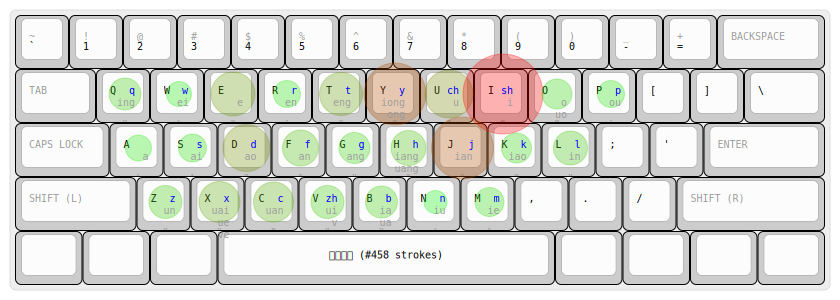 | 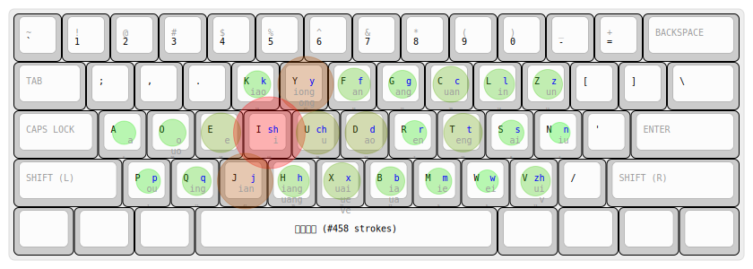 |
| 搜狗双拼 |  | 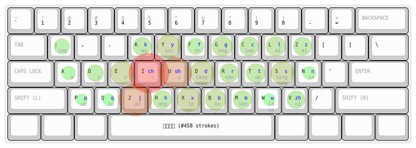 |
| 微软双拼 | 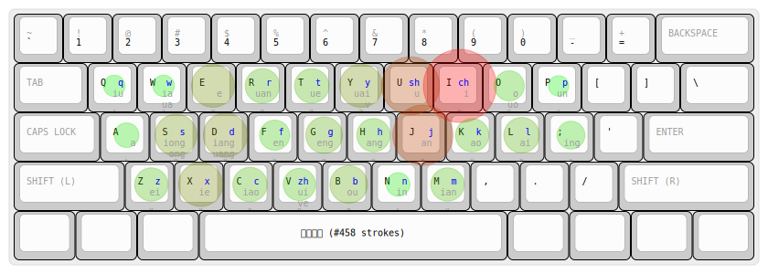 |  |
| 小鹤双拼 | 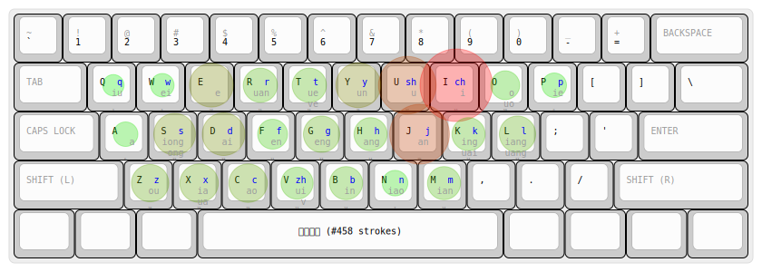 | 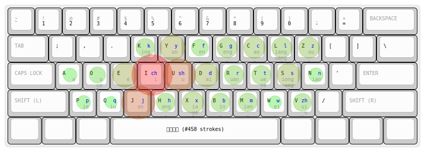 |
| 智能ABC | 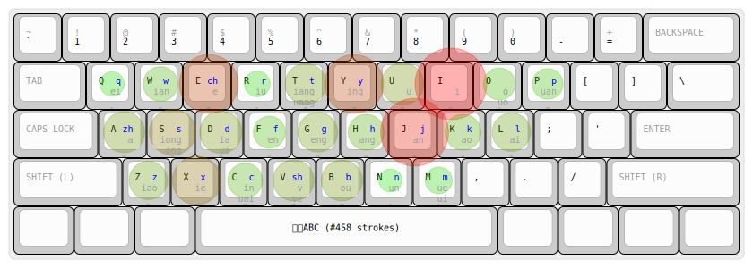 | 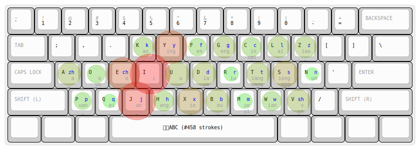 |
| 紫光双拼 | 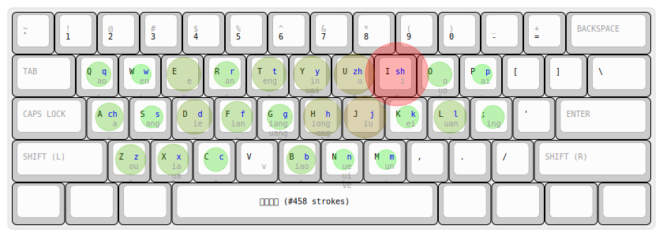 | 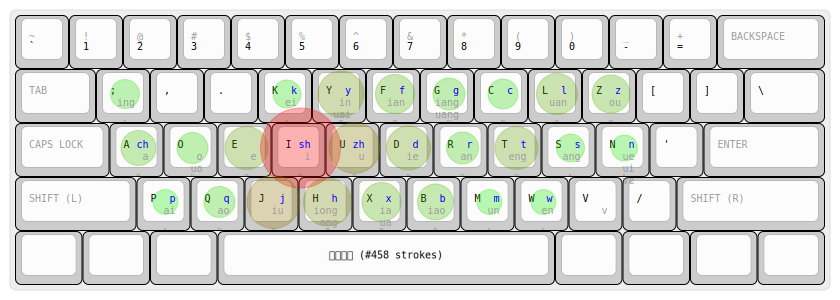 |
| 自然码 | 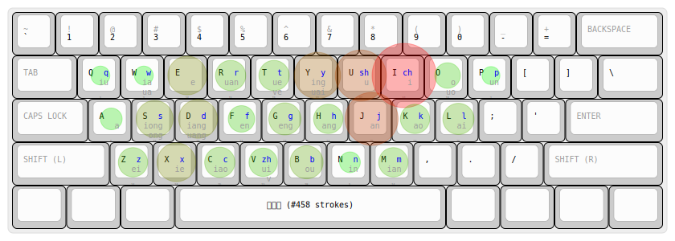 | 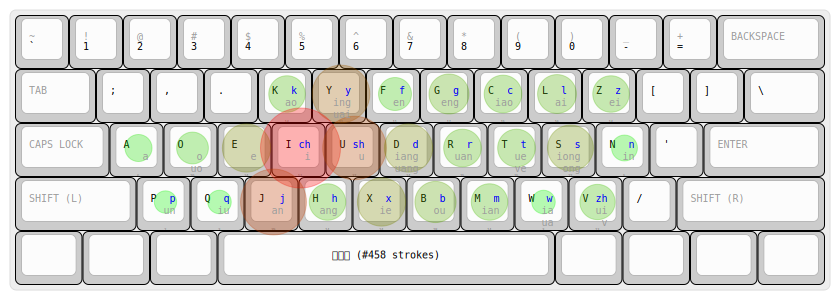 |

查看 svg：

```bash
python3 svg_player.py heatmaps/*.svg
python3 svg_player.py svgs/dvorak/*.svg svgs/qwerty/*.svg
```

## 练习模式

用来练习双拼：（shell 下用等宽字体，一个中文正好对应双拼的两个英文字符）

```bash
# 进入交互模式后，每输入一行文本，就会输出对应的双拼字符，用 control-d 退出
$ python3 shuangpin_heatmap.py --interactive-mode 1
神州行，我看行。
ufvbxy，wokjxy。
神州行，我看行。
```

[](https://asciinema.org/a/293837)

默认自然码，可以换其他双拼模式：

```
$ python3 shuangpin_heatmap.py --list-all-shuangpin-schemas 1
available shuangpin schemas:
[
    "pinyinjiajia",
    "sougou",
    "weiruan",
    "xiaohe",
    "zhinengabc",
    "ziguang",
    "ziranma"
]

$ python3 shuangpin_heatmap.py --interactive-mode 1 --shuangpin-schema-name sougou
神州行，我看行。
ufvbx;，wokjx;。
神州行，我看行。
```

也可以输入一个文件：

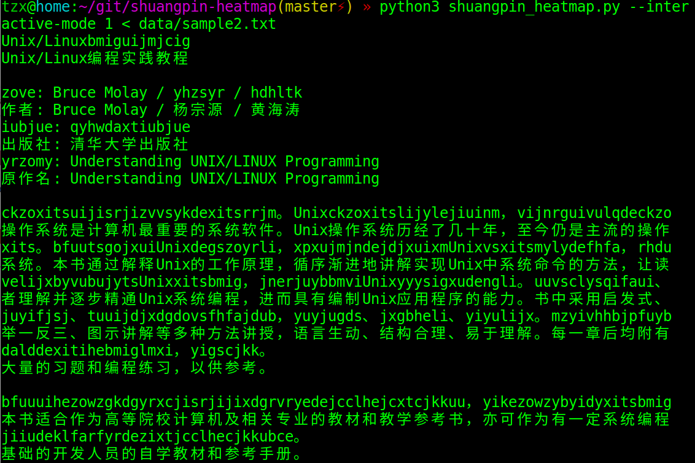

更多选项见 `--help` 帮助。

## References

-   https://github.com/hankcs/HanLP
-   https://github.com/mozillazg/python-pinyin
-   http://lingua.mtsu.edu/chinese-computing/statistics/bigram/list.php?nowstage=1&nowpage=1&Corpus=GF&BiFreq=50&MI=3.5
-   [各双拼输入方案之间有明显的优劣之分吗？](https://www.zhihu.com/question/20191383)
-   [双拼自然码 dvorak (mod) layout](http://www.keyboard-layout-editor.com/##@_name=dvorak%20mod&pcb:false%3B&@=~%0A%60&=!%0A1&=%2F@%0A2&=%23%0A3&=$%0A4&=%25%0A5&=%5E%0A6&=%2F&%0A7&=*%0A8&=(%0A9&=)%0A0&=%2F_%0A-&=+%0A%2F=&_w:2%3B&=Backspace%3B&@_w:1.5%3B&=Tab&=%2F:%0A%2F%3B&=%3C%0A,&=%3E%0A.&=K%0A%0Ak%0A%0A%0A%0A%0Aao&=Y%0A%0Ay%0Auai%0A%0A%0A%0Aing&=F%0A%0Af%0A%0A%0A%0A%0Aen&=G%0A%0Ag%0A%0A%0A%0A%0Aeng&=C%0A%0Ac%0A%0A%0A%0A%0Aiao&=L%0A%0Al%0A%0A%0A%0A%0Aai&=Z%0A%0Az%0A%0A%0A%0A%0Aei&=%7B%0A%5B&=%7D%0A%5D&_w:1.5%3B&=%7C%0A%5C%3B&@_w:1.75%3B&=Control&=A%0A%0A%0A%0A%0A%0A%0Aa&=O%0A%0A%0Aou%0A%0A%0A%0Ao&=E%0A%0A%0A%0A%0A%0A%0Ae&_n:true%3B&=I%0A%0Ach%0A%0A%0A%0A%0Ai&=U%0A%0Ash%0A%0A%0A%0A%0Au&=D%0A%0A%0Auang%0A%0A%0A%0Aiang&_n:true%3B&=R%0A%0Ar%0A%0A%0A%0A%0Auan&=T%0A%0At%0Ave%0A%0A%0A%0Aue&=S%0A%0A%0Aong%0A%0A%0A%0Aiong&=N%0A%0An%0A%0A%0A%0A%0Ain&=%22%0A'&_w:2.25%3B&=Enter%3B&@_w:2.25%3B&=Shift&=P%0A%0Ap%0A%0A%0A%0A%0Aun&=Q%0A%0Aq%0A%0A%0A%0A%0Aiu&=J%0A%0Aj%0A%0A%0A%0A%0Aan&=H%0A%0Ah%0A%0A%0A%0A%0Aang&=X%0A%0Ax%0A%0A%0A%0A%0Aie&=B%0A%0Ab%0A%0A%0A%0A%0Aou&=M%0A%0Am%0A%0A%0A%0A%0Aian&=W%0A%0Aw%0Aua%0A%0A%0A%0Aia&_w2:1.5%3B&=V%0A%0Azh%0Av%0A%0A%0A%0Aui&=%3F%0A%2F%2F&_w:2.75%3B&=Shift%3B&@_w:1.25%3B&=Ctrl&_w:1.25%3B&=Win&_w:1.25%3B&=Alt&_a:7&w:6.25%3B&=&_a:4&w:1.25%3B&=Alt&_w:1.25%3B&=Win&_w:1.25%3B&=Menu&_w:1.25%3B&=Ctrl)
